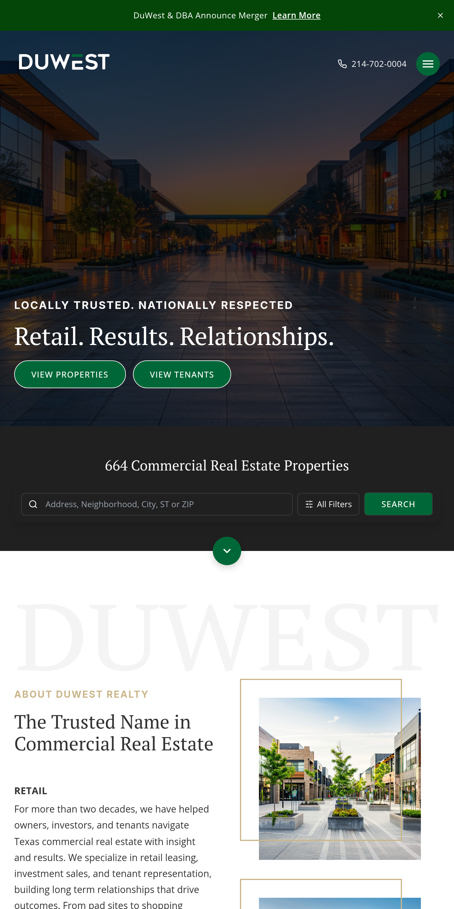
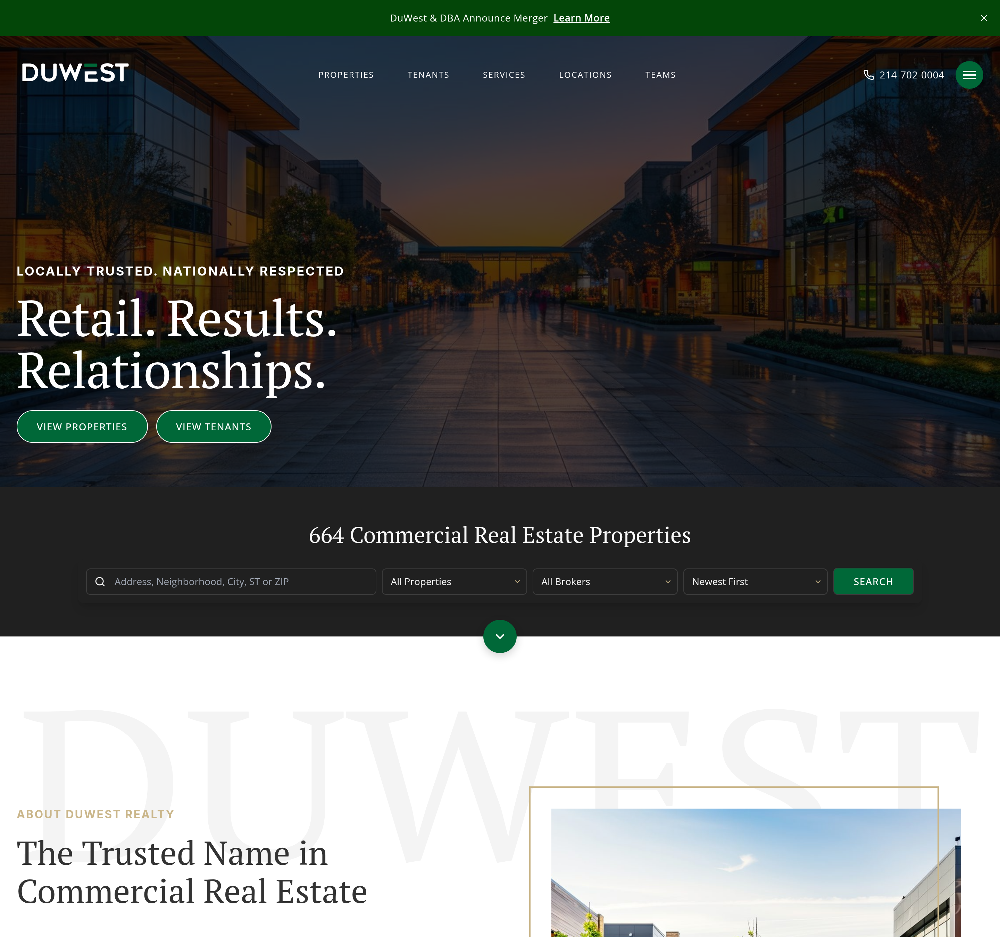

# Screenshots - DuWest Commercial Real Estate

Visual testing across common device sizes for https://keylistings.com/customers/duwest

---

<table>
<tr>
<td width="33%">

### iPhone SE/8
(375x667)

</td>
<td width="33%">

### iPhone XR/11
(414x896)

</td>
<td width="33%">

### iPad Portrait
(768x1024)

</td>
</tr>

<tr>
<td width="33%">

### iPad Landscape
(1024x768)

</td>
<td width="33%">

### MacBook Pro
(1440x900)

</td>
<td width="33%">

### Full HD
(1920x1080)

</td>
</tr>
</table>

---

**Captured:** 2026-04-27
**Tool:** Puppeteer headless browser (2x device scale for retina quality)
